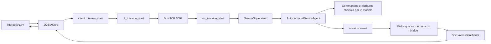

# Cycle 1 — Audit croisé et résilience

Date : 19 septembre 2026. Dépôts : `/home/juan/AuroraIA` et `/home/juan/aurora-remote-cli`.

Les correctifs sont intégrés et committés localement. Les validations sont isolées ; les services actifs n'ont pas été redémarrés et aucun push n'a été effectué. Ce cycle établit des progrès vérifiés sur l'authentification CLI, la reprise des flux et le contrôle géométrique. Il ne démontre ni une AGI, ni la perfection des générations, ni une parité intégrale des clients.

## 1. État de l'architecture

### Périmètre effectivement scanné

| Mesure initiale | Cerveau | CLI | Preuve |
|---|---:|---:|---|
| Fichiers suivis inventoriés et hachés | 2 062 | 40 | `before/summary.json:3` |
| Fonctions/méthodes Python indexées par AST | 6 388 | 102 | `before/summary.json:4` |
| Lignes de sources inventoriées | 607 140 | 2 591 | `before/summary.json:12` |
| Fichiers de l'arborescence physique, sans lire leur contenu | 259 550 | 429 | `before/summary.json:13` |
| Erreurs de parsing Python | 0 | 0 | `before/summary.json:9` |

Le scan TypeScript/JavaScript couvre aussi 860 fichiers et 19 905 fonctions, sans erreur de parsing. Le graphe statique résout 2 853 imports internes et trouve 18 composantes cycliques ; 7 804 imports sont externes ou non résolus. Les appels dynamiques restent explicitement hors de cette résolution. Sources : `before/typescript-summary.json:2`, `before/dependencies-summary.json:4`, `scripts/audit/relationships.py:43`.

Le complément hors Git analyse 2 471 fichiers Python dans ComfyUI, soit 582 923 lignes, et les cinq scripts des dossiers `lab_div_zero` et `transfer_to_client`. Aucun de ces scripts expérimentaux n'est exécuté par le scanner. Les environnements virtuels, caches de bytecode, `.git` et `node_modules` sont exclus du parsing ; ils figurent dans l'inventaire physique. Les poids sont recensés comme fichiers, sans lecture de leurs données. Sources : `supplemental-summary.json:2`, `scripts/audit/supplemental_inventory.py:12`.

La sonde d'import isolée enregistre **313 routes**, sans échec d'import. L'inventaire syntaxique trouve 597 décorateurs de route dans les sources, y compris les copies et sauvegardes : ces deux comptes ne mesurent pas la même chose. Le chargement ne garantit pas que toutes les branches des handlers soient exécutables. Sources : `runtime-routes.json:2`, `before/summary.json:7`, `scripts/audit/runtime_routes.py:20`.

L'inventaire après les commits de code recense 2 067 fichiers Cerveau et 42 fichiers CLI ; il comprend les nouveaux tests et le scanner déjà indexés, avant l'ajout des artefacts de ce rapport. Source : `after/summary.json:3`.

### Cycle réel d'une demande « génère un modèle 3D et affiche-le en CLI »



Références : `../aurora-remote-cli/aurora_cli/interactive.py:271`, `../aurora-remote-cli/aurora_cli/core/jobia.py:26`, `../aurora-remote-cli/aurora_cli/client.py:270`, `application/routes/cli_bp_routes.py:1026`, `agi_core/bus.py:31`, `aurora_agi_daemon.py:50`, `agi_core/swarm.py:21`, `agi_core/mission_agent.py:161`, `application/routes/cli_bp_routes.py:1076`, `application/routes/cli_bp_routes.py:1160`.

Le chemin CLI passe par l'agent à outils génériques. Il ne possède pas de dispatch déterministe vers `aurora_code`, Hunyuan ou `scene_orchestrator`. Le modèle peut proposer une commande qui les invoque, mais ce n'est pas une garantie du contrat de mission. Le contexte du workspace y est encore un dictionnaire simplifié ; `session_id` est enregistré dans le bridge sans être transmis au daemon dans `mission.start`. Sources : `agi_core/mission_agent.py:19`, `agi_core/mission_agent.py:249`, `application/routes/cli_bp_routes.py:1050`, `application/routes/cli_bp_routes.py:1059`.

Le chemin natif de génération est distinct : `runPythonScript` démarre un job via `/api/python/run-async`, puis le bridge lance le script dans un sous-processus. `aurora_3d_pipeline.py` branche les scènes multi-objets vers l'orchestrateur, possède une branche Hunyuan et une étape de rigging. Sources : `application/src/hooks/useTauri.ts:1273`, `application/routes/python_bp_routes.py:827`, `application/routes/python_bp_routes.py:554`, `application/python-services/aurora_3d_pipeline.py:3019`, `application/python-services/aurora_3d_pipeline.py:4105`, `application/python-services/aurora_3d_pipeline.py:741`.

La livraison distante reste incomplète : `mission.py` sait décoder un événement `file_transfer` en Base64, alors que le proxy interactif ne traite que tokens, reconnexion, erreur et fin. L'agent crée `.transfer_to_client`, mais ses instructions mentionnent aussi `transfer_to_client` ; aucun manifeste d'asset n'est produit par ce chemin. `SmartPayloadManager` renvoie soit du Base64 intégral, soit un chemin absolu du serveur. Sources : `../aurora-remote-cli/aurora_cli/mission.py:145`, `../aurora-remote-cli/aurora_cli/core/jobia.py:44`, `agi_core/mission_agent.py:163`, `agi_core/mission_agent.py:203`, `agi_core/payload_manager.py:15`.

### Dette et goulots encore ouverts

| Priorité | Constat sourcé | Conséquence et patch prévu |
|---|---|---|
| P0 | Authentification restaurée sur les 42 routes CLI, mais absence de garde équivalente sur l'exécution Python et les téléchargements : `application/routes/python_bp_routes.py:827`, `application/routes/asset_bp_routes.py:104` | Étendre un contrat d'autorisation aux autres surfaces avant de considérer le bridge protégé. |
| P0 | Les candidats de téléchargement acceptent des chemins sans confinement canonique : `application/routes/asset_bp_routes.py:107` | Limiter les artefacts à des racines autorisées, vérifier symlinks et traversées, tester les refus. |
| P0 | `_cli_mission_emit` est appelé mais non défini dans l'arrêt ; aucun abonnement `mission.stop` dans le daemon : `application/routes/cli_bp_routes.py:1213`, `aurora_agi_daemon.py:62` | Annuler réellement la tâche et son groupe de sous-processus, attendre l'accusé, puis clôturer le flux. |
| P0 | Le bus diffuse aux sockets présents, sans journal durable ni accusé d'exécution : `agi_core/bus.py:94`, `application/routes/cli_bp_routes.py:1128` | Journal séquencé, ACK de prise en charge, déduplication et rattrapage après déconnexion du bridge. Le succès de `sendall` ne prouve pas l'exécution. |
| P0 | `self.permissions` est stocké mais les branches `run_command`/`write_file` ne consultent pas cette politique : `agi_core/mission_agent.py:32`, `agi_core/mission_agent.py:257`, `agi_core/mission_agent.py:295` | Autorisation centralisée au dispatch des outils, tests SAFE/STANDARD/FULL, confinement réel. La validation du nom du niveau dans l'API ne suffit pas. |
| P1 | Historique de mission en RAM, sans rétention bornée : `application/routes/cli_bp_routes.py:44`, `application/routes/cli_bp_routes.py:1054` | Stockage durable avec quota/rétention, curseur sauvegardé côté client, reprise par session. |
| P1 | L'agent itère sur un flux `requests` synchrone dans une coroutine : `agi_core/mission_agent.py:228` | Déporter toute la lecture bloquante ou utiliser le client asynchrone ; tester deux missions pendant un serveur lent. |
| P1 | Le superviseur ComfyUI ne cherche que `venv/Scripts/python.exe` : `application/python-services/comfy_supervisor.py:45` | Détection Linux/Windows et test de redémarrage contrôlé, puis budget GPU partagé. |
| P1 | `mem_get_info()` affecté à `t, f`, affiché avec les rôles libre/total inversés : `application/python-services/aurora_hunyuan/pipeline_hunyuan_robust.py:53` | Corriger la télémétrie et mesurer le pic de VRAM sur un corpus ; aucun gain VRAM revendiqué ici. |
| P1 | Mémoire d'échecs : lecture-modification-écriture sans verrou autour du cycle : `auto_rl/failure_memory.py:58`, `auto_rl/failure_memory.py:98` | Verrou par module ou transactions pour éviter les mises à jour perdues entre entraîneurs. |
| P2 | `aurora_uplift` écrit des propositions, pas une validation d'amélioration mesurée : `application/python-services/aurora_uplift/aurora_module_uplift.py:236` | Évaluation comparative des propositions sur un jeu réservé avant promotion. |

Le scan relève 30 groupes de fichiers identiques, dont des sauvegardes ; cela constitue une piste de consolidation et non une preuve de code mort. Aucun fichier n'a été supprimé sur la seule absence d'import statique. Sources : `before/summary.json:10`, `before/AuroraIA.json.gz` (champ `duplicate_files`).

## 2. Tableau de notation pondéré

Notes de revue provisoires, sur 10. **N = (3 J + 2 R + 3 P + 2 O) / 10**. J : justesse du contrat et des résultats ; R : robustesse de l'exécution/API ; P : parité et synchronisation avec la CLI ; O : observabilité et exploitation des échecs. Pour un moteur, R et P évaluent notamment son exposition au reste du système.

Barème : 0–2 absent ou contredit par le code ; 3–4 partiel avec défaut majeur ; 5–6 contrat utile avec tests ciblés mais limites importantes ; 7–8 couverture représentative incluant intégration et pannes ; 9–10 validation de bout en bout sur le corpus et les charges cibles. Les notes de justesse des générateurs sont plafonnées faute de benchmark sémantique/visuel. Elles ne sont pas des pourcentages de réussite. Les anciens scores avaient une autre grille et ne servent pas de baseline numérique.

| Composant | J ×3 | R ×2 | P ×3 | O ×2 | N /10 | Plan immédiat pour toute note <9 | Référence |
|---|---:|---:|---:|---:|---:|---|---|
| API CLI | 6 | 6 | 6 | 4 | **5.6** | P0: durabilite IPC et arret reel | `application/routes/cli_bp_routes.py:1213` |
| Autres routes API | 4 | 2 | 3 | 3 | **3.1** | P0: authentification et confinement des chemins | `application/routes/python_bp_routes.py:827` |
| aurora_uplift | 4 | 4 | 2 | 5 | **3.6** | P2: evaluation des propositions avant application | `application/python-services/aurora_uplift/aurora_module_uplift.py:206` |
| aurora_code | 6 | 5 | 3 | 5 | **4.7** | P1: exposer les validateurs dans les missions CLI | `application/python-services/aurora_code/aurora_code_validators.py:180` |
| aurora_hunyuan | 6 | 5 | 3 | 5 | **4.7** | P1: corpus de generations et gate partage par les wrappers | `application/python-services/aurora_hunyuan/aurora_loop_robust.py:144` |
| scene_orchestrator | 6 | 5 | 3 | 4 | **4.5** | P1: contrat de routage et budgets par objet | `application/python-services/scene_orchestrator.py:763` |
| Rigging | 6 | 5 | 3 | 4 | **4.5** | P1: tests de deformation et animation sur corpus GLB | `application/python-services/rigify_autorig.py:1535` |
| Services cyber | 5 | 4 | 2 | 4 | **3.7** | P1: appliquer le validateur au dispatch du daemon | `application/python-services/cyber/_safety.py:58` |
| Auto-RL | 6 | 5 | 2 | 6 | **4.6** | P1: journal concurrent des echecs et mesures avant/apres | `auto_rl/failure_memory.py:48` |
| ComfyUI et custom nodes | 5 | 4 | 3 | 4 | **4.0** | P1: superviseur Linux et budget GPU commun | `application/python-services/comfy_supervisor.py:44` |
| Daemon et bus IPC | 3 | 3 | 3 | 3 | **3.0** | P0: accusés durables, annulation et timeouts | `agi_core/bus.py:94` |
| CLI core et interface | 6 | 6 | 5 | 4 | **5.3** | P1: checkpoint local et historique par session | `../aurora-remote-cli/aurora_cli/core/jobia.py:26` |
| Transport des assets | 2 | 2 | 1 | 2 | **1.7** | P0: manifeste SHA-256, Range, reprise et ecriture atomique | `../aurora-remote-cli/aurora_cli/mission.py:145` |
| Labos de resilience | 3 | 3 | 2 | 2 | **2.5** | P1: remplacer scripts manuels par tests isoles reproductibles | `../aurora-remote-cli/lab_div_zero/test_div_zero.py:1` |

Données exportables : [scores.csv](scores.csv).

## 3. Changelog et preuves chiffrées

| Dépôt et commit | Correctif | Preuve avant → après |
|---|---|---|
| AuroraIA `9359d26` | Authentification effective, enregistrement soumis à une clé existante, validation de la mission, erreur 503 si la connexion IPC échoue, replay SSE par curseur | `/api/cli/auth` sans clé : 500 → 401 ; clé valide : 500 → 200. Les 42 routes CLI refusent l'accès anonyme dans le test. `tests_agi/test_cli_resilience.py:55`, `tests_agi/test_cli_resilience.py:62`. |
| CLI `5ae7cf0` | En-tête d'autorisation à la connexion, décodage SSE par événement complet, reprise GET bornée, aucune répétition du POST, erreurs et état de reconnexion affichés | Coupure HTTP injectée après l'événement 1 : 100/100 tokens reçus, 0 perte, 0 doublon, deux connexions. `tests_agi/test_cli_resilience.py:154`. Les erreurs et fins absentes ne deviennent plus des succès : `../aurora-remote-cli/tests/test_stream_recovery.py:116`. |
| AuroraIA `f5c81b5` | Géométrie et critique bloquantes ; réparations validées avant remplacement ; audit périmé écarté ; chemins du dépôt et Blender portables | Le cube fermé GLB passe de 24 faux bords ouverts et 6 morceaux à 0 et 1 ; le plan ouvert reste rejeté avec 4 bords ouverts. `tests_agi/test_blender_geometry_contract.py:13`. Refus des critiques absentes, négatives ou NaN : `tests_agi/test_hunyuan_quality_gate.py:79`. |

Les tests de concurrence comparent 32 historiques lus avec 8 threads sur 101 événements, chacun avec son curseur : aucun historique incorrect. Ce test ne mesure pas 32 inférences GPU concurrentes. Source : `tests_agi/test_cli_resilience.py:137`.

**43 tests passent**, exécutés en trois suites : 23 Cerveau, 19 CLI, puis 1 intégration Blender. Journaux : `brain-tests.log.gz`, `client-tests.log.gz`, `blender-tests.log.gz`. Les journaux avant correctifs sont dans `before/`. Mesures structurées : [measurements.json](measurements.json). Les fichiers modifiés compilent avec `py_compile` et `git diff --check` passe dans les deux dépôts.

Environnement de validation : Python 3.12, environnement temporaire `/tmp/aurora-resilience-venv` avec accès aux paquets système et ajout de Flask-CORS, questionary et aiohttp ; Blender 5.1.1. Ces installations de test ne remplacent pas les environnements de production. Commandes reproductibles, depuis chaque dépôt :

```bash
# Cerveau ; le dépôt CLI voisin permet le test HTTP croisé.
/tmp/aurora-resilience-venv/bin/python -m unittest discover -s tests_agi -v

# CLI
/tmp/aurora-resilience-venv/bin/python -m unittest discover -s tests -v

# Inventaires depuis le Cerveau ; utiliser un nouveau dossier de sortie.
python3 scripts/audit/inventory.py --output /tmp/aurora-inventory --physical-tree
node scripts/audit/typescript.mjs /tmp/aurora-inventory
python3 scripts/audit/relationships.py /tmp/aurora-inventory
python3 scripts/audit/supplemental_inventory.py --output /tmp/aurora-supplemental.json
```

Le snapshot matériel indique une RTX 5070 Ti, 16 303 MiB au total et 468 MiB utilisés ; ComfyUI et Ollama répondent HTTP 200. Il décrit l'état observé, sans comparaison de pic VRAM. Aucun chiffre de latence WAN, économie VRAM ou qualité des générations n'a été inventé. Source : [hardware.json](hardware.json).

## 4. Mécanismes intégrés et limites

- **Reprise du transport des missions** : événement complet comme unité de reprise, identifiants séquentiels, détection des trous, trois reconnexions au maximum ; un POST de création/génération n'est jamais rejoué automatiquement. Sources : `../aurora-remote-cli/aurora_cli/client.py:14`, `../aurora-remote-cli/aurora_cli/client.py:92`, `../aurora-remote-cli/tests/test_stream_recovery.py:64`.
- **Qualité géométrique bloquante dans la boucle Hunyuan robuste** : une mesure absente n'est plus interprétée comme zéro défaut. Une seule réparation est tentée, puis le résultat est contrôlé. La topologie est analysée en soudant seulement les coordonnées exactement identiques de l'import temporaire pour neutraliser les coutures GLB. Cela ne certifie ni le style, ni le rigging, ni tous les autres wrappers. Sources : `application/python-services/aurora_hunyuan/aurora_loop_robust.py:76`, `application/python-services/aurora_hunyuan/aurora_loop_robust.py:122`, `application/python-services/aurora_hunyuan/blender_mesh_auditor.py:30`.
- **Contrat Auto-RL vérifié** : l'enregistrement et le replay existaient déjà et sont appelés par l'entraînement. Les nouveaux tests vérifient la consolidation d'un échec et la préservation de la tranche d'audit ; aucune nouvelle boucle d'apprentissage n'est revendiquée. Le scan des données locales compte 36 entrées d'entraînement : 4 en 3D, 12 en animation, 20 en code. Sources : `auto_rl/runner.py:120`, `auto_rl/runner.py:201`, `tests_agi/test_failure_replay_contract.py:17`, `supplemental-summary.json` (champ `failure_memory_counts`).

Le mécanisme nommé « auto-healing » du daemon produit et mémorise une analyse textuelle du crash ; il n'applique pas de patch validé ni de relance transactionnelle. Les correctifs de ce cycle ont été réalisés et testés ici, pas générés par ce mécanisme. Sources : `aurora_agi_daemon.py:13`, `agi_core/swarm.py:94`.

La reprise SSE exige un bridge mis à jour et son historique intact. Elle ne couvre pas les redémarrages, la perte entre daemon et bridge, ni la réouverture du client. L'auto-enregistrement anonyme est supprimé : `jobia connect` demande maintenant une clé déjà autorisée si aucune n'est configurée. Les deux dépôts doivent être déployés ensemble. Sources : `application/routes/cli_bp_routes.py:44`, `../aurora-remote-cli/aurora_cli/cli.py:60`, `../aurora-remote-cli/README.md:37`.

## 5. Cible de la prochaine itération

La priorité est le **contrat durable de mission et d'artefact**, après extension de l'autorisation aux routes d'exécution/téléchargement. Il doit réunir : journal d'événements persistant, accusés IPC, annulation réelle, contexte lié à la session, manifeste des fichiers autorisés, checksum SHA-256, téléchargement segmenté avec reprise et écriture locale atomique. Les limites qui motivent cette cible sont référencées dans le tableau P0 ci-dessus et dans `agi_core/payload_manager.py:15`.

Critères d'acceptation du prochain cycle : arrêt effectif du sous-processus, reprise après redémarrage du bridge sans doublon de travail, transfert interrompu/repris byte pour byte, rejet d'un checksum faux et d'une traversée de chemin. Ensuite seulement, connecter les validateurs des générateurs à cette livraison commune et mesurer un corpus 3D/code avec pics mémoire et qualité des sorties.
